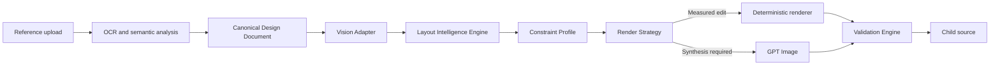

# Spyda V2 Reconstruction Architecture

## Purpose

Spyda V2 treats the uploaded design as the source of truth. It understands and
measures the design before deciding how an edit should be rendered.

## Runtime Contracts

Every V2 analysis adds these fields beside the existing `design` response:

- `architectureVersion`: `spyda-v2`
- `designDocument`: canonical objects, styles, relationships, and protection
- `visionAnalysis`: provider-neutral detections and evidence
- `layoutIntelligence`: hidden grid and object measurements
- `constraintProfile`: enforceable canvas and object locks

The workspace continues reading `design.editableComponents`, so this is a
backward-compatible migration.

## Module Ownership

| Module | Responsibility |
| --- | --- |
| `design-document.ts` | Versioned source of truth and V1 compatibility |
| `vision-adapter.ts` | Provider-neutral vision boundary and fallback |
| `analysis-pipeline.ts` | Analysis orchestration |
| `layout-intelligence.ts` | Grid, grouping, spacing, hierarchy, measurements |
| `constraint-engine.ts` | Edit authorization and geometry enforcement |
| `render-strategy.ts` | Deterministic versus AI routing |
| `validation-engine.ts` | Structural fidelity and raster dimensions |
| `api/qa.ts` | Structural report plus model-based visual inspection |

## Measurement Authority

For each measured object, Layout Intelligence records normalized and pixel
bounds, aspect ratio, rotation, anchors, margins, parent padding, grid cell,
layer order, relationships, relative position, alignment peers, confidence,
and hierarchy rank.

Model-estimated boxes remain evidence, not unquestioned truth. A configured
vision adapter may refine them. Objects with no reliable bounds are reported
as warnings and cannot silently enter the deterministic renderer.

## Failure Behavior

- Vision service unavailable: use Document and OCR geometry, add a warning.
- Missing object bounds: keep the atom editable but require AI-assisted output.
- Constraint violation: restore the protected property and report the issue.
- AI QA unavailable: return deterministic structure and dimension validation.
- No OpenAI key: deterministic plans still run; AI-assisted plans explain that
  the key is required.
